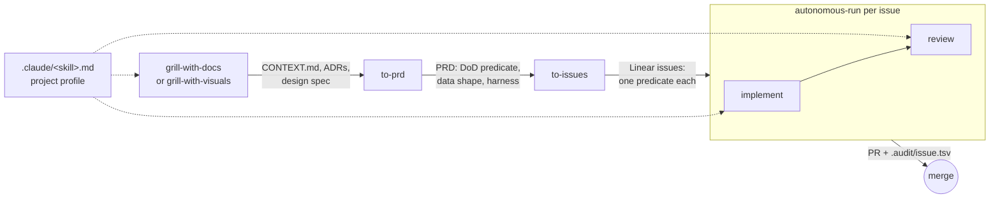

# The spec-to-session pipeline

Five stages. Each consumes the previous stage's artifact and produces one of
its own. Three of the stages are **contract skills** that read a **project
profile** (`.claude/<skill>.md`) for stack-specific behaviour and fall back
when it is absent (`docs/profiles.md`, ADR 0002).



## Stages

| Stage | Consumes | Produces | Contract? |
|---|---|---|---|
| `grill-with-docs` | a plan, the repo's `CONTEXT.md` and `docs/adr/` | resolved terms in `CONTEXT.md`, ADRs for one-way doors, prototype SHAs | no |
| `grill-with-visuals` | same, plus a plan with UI or structural decisions | the above plus a design spec of HEEx/Mermaid fragments | yes; falls back to `grill-with-docs` |
| `to-prd` | the grilled conversation | a local PRD with Definition of Done predicate, Data Shape, Verification Harness, Throughput Checkpoint | no |
| `to-issues` | the PRD | Linear Project + child issues; each issue = one runnable Predicate = one PR = one session; bodies linted by `scripts/check-issue.sh` | no |
| `orchestrate <project>` | a Linear Project (PRD + issues) | one implementer per issue, `.audit/<project>/synthesis.md`, drift verdicts, the Project at its Definition of Done | yes (`## Budgets`, `## Isolation`, `## Concurrency`, `## Drift check`) |
| `autonomous-run <issue>` | one issue (directly, or as an implementer spawned by `orchestrate`) | a branch, a PR, `.audit/<issue-id>.tsv`, a fragment | wraps two contracts |
| `implement` | the issue, the profile's feedback loops | a committed, gate-passing change | yes |
| `review` | the diff, the issue's `review:` line, the profile's seat catalogue | a verdict per seat with evidence, on one head SHA | yes |

## The checkpoint rule (ADR 0003)

Every issue ends with a `/review` **checkpoint**, never a full committee by
default. The run set is:

```
named(issue.review line) ∪ fired(diff, profile.seats) ∪ {audit, regression}
```

- `to-issues` writes `review: auto` or `review: auto + <seat>, …` in the
  issue's `## Verify` block. Named seats cover hazards the slicer knows and a
  diff cannot show. `check-issue.sh` requires the line and checks seat names
  against `.claude/review.md` when it exists.
- `/review` adds every seat whose trigger fires on the diff.
- The two **contract seats** run everywhere: **audit** (reads the diff and the
  evidence pack, distrusts the PR body) and **regression** (runs the issue's
  `live:` line at `base_ref` and at head).
- The **full committee** (every catalogue seat plus the contract seats) runs
  only on issues marked `Review gate: interaction` and on the last slice of a
  Project, whose predicate is the PRD's Definition of Done. Both on the
  merge-ready head SHA, before merge.

## Context lifecycle of a multi-issue run (ADR 0005)

`orchestrate` keeps the conductor's context bounded by construction: the intent
once, one fragment per issue, one synthesis rewrite, one drift verdict. Each
implementer is a fresh subagent under a turn budget the orchestrator measures
from the trail. After every fragment a clean-context drift check compares the
synthesis with the PRD and issues: execution drift re-briefs or preempts the
implementer autonomously; intent drift pauses the run for the operator.
Preemption is a hard stop; the replacement starts on the same branch and tree,
judges the existing commits against the predicate, and receives nothing
authored by its predecessor.

## Grill discipline carried through

Questions are classified before they are asked: answerable by reading the
codebase (read it), answerable by running something (run it via `prototype`,
cite the SHA), or a product call (ask). One-way doors get two structurally
distinct candidate shapes before a recommendation, and an ADR with evidence.
`to-prd` inherits the prototype SHAs and one-way-door marks; `to-issues` turns
one-way doors into `Review gate: interaction` slices.
